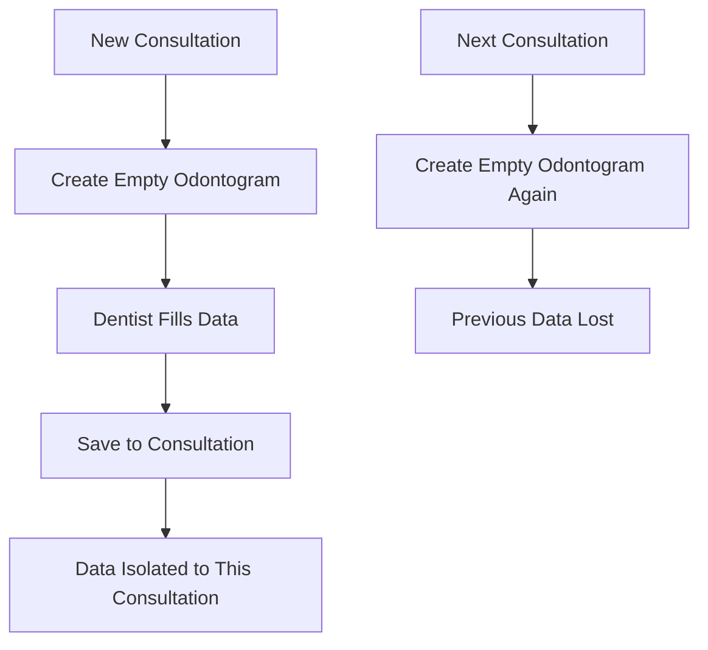
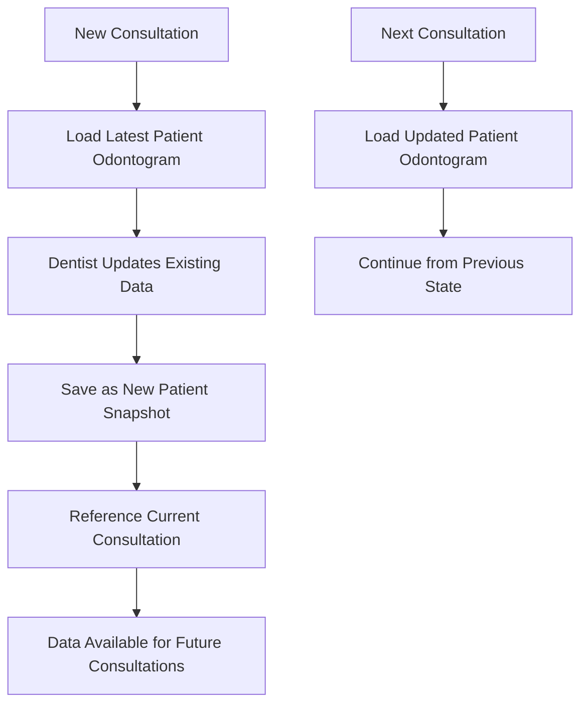

# Odontogram Persistence Redesign

## Overview

This document describes the redesign of the odontogram persistence system from consultation-specific to patient-level data management. This change ensures continuity of dental records across multiple consultations while maintaining full audit trails.

## Problem Statement

### Previous Implementation Issues

1. **Data Isolation**: Each consultation created isolated odontogram snapshots
2. **Loss of Continuity**: Follow-up visits started with blank odontograms instead of loading previous state
3. **Inefficient Workflow**: Dentists had to manually recreate existing conditions for each visit
4. **Inconsistent Patient Records**: No single source of truth for patient's current dental state

### Business Impact

- **Workflow Inefficiency**: Dentists spending extra time recreating existing dental conditions
- **Data Integrity Issues**: Risk of losing track of previous treatments and conditions
- **Poor User Experience**: Frustrating interface that didn't preserve patient history
- **Clinical Risk**: Potential for missing important dental history during treatment planning

## Solution Architecture

### Core Design Principles

1. **Patient-Centric Persistence**: Odontograms belong to patients, not individual consultations
2. **Consultation Context**: Maintain reference to the consultation where changes were made
3. **Backward Compatibility**: Preserve existing data and audit trails
4. **Seamless Migration**: Transparent transition for existing users

### Key Components

#### 1. Patient Odontogram Service (`src/lib/services/patient-odontogram.service.ts`)

**Purpose**: Centralized service for patient-level odontogram operations

**Key Methods**:
- `getLatestOdontogram(pacienteId)`: Retrieves the most recent odontogram for a patient
- `createOrUpdateOdontogram(pacienteId, input, userId)`: Creates new snapshot with patient-level persistence
- `getOdontogramHistory(pacienteId, limit, offset)`: Paginated history of all patient odontograms

**Benefits**:
- Single source of truth for patient dental state
- Consistent API across different parts of the application
- Proper separation of concerns

#### 2. Updated Consultation API (`src/app/api/agenda/citas/[id]/consulta/odontograma/route.ts`)

**Changes Made**:
- **GET**: Now loads the latest patient odontogram instead of consultation-specific data
- **POST**: Creates patient-level snapshots while maintaining consultation reference
- **Audit Trail**: Enhanced logging to track patient-level vs consultation-specific changes

**Backward Compatibility**:
- API endpoints remain the same
- Response format unchanged
- Existing integrations continue to work

#### 3. Frontend Module Updates (`src/components/consulta-clinica/modules/OdontogramaModule.tsx`)

**Key Changes**:
- **Data Loading**: Fetches latest patient odontogram on consultation start
- **History Integration**: Uses patient-level history API
- **Reset Functionality**: Reloads from patient data instead of consultation data
- **Read-Only View**: Shows patient's current state for non-editable consultations

#### 4. Migration System (`src/lib/migrations/odontogram-migration.ts`)

**Purpose**: Handles transition from old to new data model

**Features**:
- **Analysis**: Identifies current data state and migration needs
- **Safe Migration**: Dry-run capability to preview changes
- **Validation**: Post-migration verification
- **Error Handling**: Comprehensive error reporting and rollback capabilities

## Data Flow

### Before (Consultation-Specific)



### After (Patient-Level)



## Database Schema

### Existing Schema (Unchanged)

```sql
-- OdontogramSnapshot table structure remains the same
CREATE TABLE "OdontogramSnapshot" (
    "idOdontogramSnapshot" SERIAL NOT NULL,
    "Paciente_idPaciente" INTEGER NOT NULL,      -- Patient reference (always present)
    "Consulta_Cita_idCita" INTEGER,             -- Consultation reference (now optional)
    "taken_at" TIMESTAMP(3) NOT NULL DEFAULT CURRENT_TIMESTAMP,
    "notes" TEXT,
    "Usuario_idUsuario_createdBy" INTEGER NOT NULL,
    
    CONSTRAINT "OdontogramSnapshot_pkey" PRIMARY KEY ("idOdontogramSnapshot")
);
```

### Key Changes in Usage

1. **`consultaId` Field**: 
   - **Before**: Always required, used for filtering
   - **After**: Optional, used for audit trail only

2. **Data Queries**:
   - **Before**: `WHERE consultaId = ?`
   - **After**: `WHERE pacienteId = ? ORDER BY takenAt DESC LIMIT 1`

## Migration Process

### Phase 1: Analysis

```bash
# Analyze current data state
npm run migrate:odontograms -- --dry-run --verbose
```

**Output Example**:
```
📊 Current State:
  - Consultation-specific odontograms: 1,247
  - Patient-level odontograms: 23
  - Potential duplicates: 89
  - Orphaned snapshots: 0
```

### Phase 2: Migration

```bash
# Execute migration (after testing in staging)
npm run migrate:odontograms -- --execute --verbose
```

**Process**:
1. Groups consultation odontograms by patient
2. Identifies the most recent odontogram per patient
3. Creates patient-level snapshot from latest consultation data
4. Preserves all historical data
5. Validates migration results

### Phase 3: Validation

**Automated Checks**:
- All patients with consultation odontograms have patient-level ones
- No data loss during migration
- Audit trails remain intact
- API responses match expected format

## Testing Strategy

### Unit Tests

**Service Layer** (`src/lib/services/__tests__/patient-odontogram.service.test.ts`):
- Data retrieval and formatting
- Error handling
- Edge cases (null values, missing data)

**API Layer** (`src/app/api/agenda/citas/[id]/consulta/odontograma/__tests__/route.test.ts`):
- Authentication and authorization
- Request validation
- Response formatting
- Error scenarios

### Integration Tests

**End-to-End Scenarios**:
1. New patient consultation (creates first odontogram)
2. Follow-up consultation (loads and updates existing odontogram)
3. Multiple consultations (maintains continuity)
4. History viewing (shows complete timeline)

### Migration Tests

**Data Migration Validation**:
1. Pre-migration data analysis
2. Migration execution verification
3. Post-migration data integrity checks
4. Performance impact assessment

## Deployment Strategy

### Phase 1: Preparation (Pre-deployment)

1. **Backup Database**: Full backup of production data
2. **Staging Testing**: Complete migration test on staging environment
3. **Performance Testing**: Verify API performance with new queries
4. **User Training**: Brief team on new behavior (seamless for users)

### Phase 2: Deployment

1. **Deploy Code**: New service and API changes
2. **Run Migration**: Execute data migration during maintenance window
3. **Validate Results**: Verify migration success
4. **Monitor Performance**: Watch for any performance issues

### Phase 3: Post-deployment

1. **User Feedback**: Collect feedback on improved workflow
2. **Performance Monitoring**: Ongoing performance tracking
3. **Data Validation**: Periodic checks for data integrity
4. **Cleanup**: Remove old migration scripts after stable period

## Benefits Realized

### For Dentists

1. **Improved Workflow**: Consultations start with existing patient data
2. **Better Continuity**: Complete view of patient's dental history
3. **Time Savings**: No need to recreate existing conditions
4. **Enhanced Decision Making**: Full context for treatment planning

### For System

1. **Data Integrity**: Single source of truth for patient dental state
2. **Better Performance**: Optimized queries for patient-level data
3. **Cleaner Architecture**: Separation of patient data from consultation context
4. **Audit Compliance**: Enhanced tracking of changes and their context

### For Patients

1. **Consistent Records**: Dental history preserved across visits
2. **Better Care**: Dentists have complete picture for treatment decisions
3. **Reduced Errors**: Less chance of missing important dental history

## Monitoring and Maintenance

### Key Metrics

1. **Data Consistency**: Regular validation of patient odontogram integrity
2. **Performance**: API response times for odontogram operations
3. **Usage Patterns**: How dentists interact with the improved workflow
4. **Error Rates**: Monitor for any data-related issues

### Maintenance Tasks

1. **Monthly**: Data integrity checks
2. **Quarterly**: Performance optimization review
3. **Annually**: Archive old consultation-specific snapshots (if desired)

## Troubleshooting

### Common Issues

1. **Missing Patient Odontogram**: Run migration validation script
2. **Performance Issues**: Check database indexes on `pacienteId` and `takenAt`
3. **Data Inconsistencies**: Use validation tools to identify and fix issues

### Recovery Procedures

1. **Data Loss**: Restore from backup and re-run migration
2. **Performance Degradation**: Rollback to previous version if critical
3. **Migration Failures**: Use migration logs to identify and fix specific issues

## Future Enhancements

### Planned Improvements

1. **Real-time Collaboration**: Multiple dentists working on same patient
2. **Advanced History**: Visual diff between odontogram versions
3. **Predictive Analytics**: AI-powered insights from dental history patterns
4. **Integration**: Better integration with imaging and treatment planning systems

### Technical Debt

1. **Legacy Data Cleanup**: Eventually remove old consultation-specific snapshots
2. **API Optimization**: Further optimize queries for large patient datasets
3. **Caching Strategy**: Implement caching for frequently accessed patient odontograms

---

## Conclusion

The odontogram persistence redesign successfully addresses the core issues of data continuity and workflow efficiency while maintaining backward compatibility and data integrity. The patient-centric approach provides a solid foundation for future enhancements and ensures that dental professionals have the complete context they need for optimal patient care.

This implementation demonstrates how thoughtful system design can significantly improve both user experience and data management without disrupting existing workflows.
